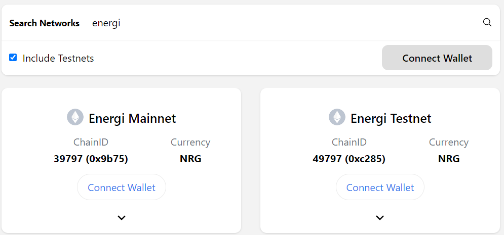

# Create and Mint NFT using AI


## 1. Configure MetaMask

Add Energi Testnet Network to MetaMask by going to [https://chainlist.org](https://chainlist.org/?search=energi&testnets=true).




## 2. Clone/Download the Repository

Create an account on [https://replit.com](https://replit.com).

Fork the following Replit

```bash
https://replit.com/@smartNFTs/ai-generated-nft
```


## 3. Create APIs

### 3.1. Create API on AI NFT Generator

Create an account on [Hugging Face](https://huggingface.co/). Visit your profile settings, and create a `read` access token.

### 3.2. Create API on IPFS Storage

Create an account on [NFT.Storage](https://nft.storage/), and then create a new API key.


## 4. Setup Secrets

On your Replit, go to "Shell and run the following command:

```
cp .env.example .env
```

Open `Secrets` from "Tools". Update the following variables with your information. This will stay secure and cannot be copied when your Replit is forked by someone.

- **ACCOUNT_PRIVATE_KEY""** - Get the private key for your owner account from MetaMask
- **REACT_APP_HUGGING_FACE_API_KEY""** - Populate the API from step 3 above
- **REACT_APP_NFT_STORAGE_API_KEY** - Populate the API from step 3 above. Do not put any quotes around the API


## 5. Name your Collection

### 5.1. Update Deployment Variables

Edit lines 4, 5 and 6 of `scripts/deploy.js`:

```
  const NAME = "AI Generated NFT"
  const SYMBOL = "AINFT"
  const COST = ethers.utils.parseUnits("1", "ether") // 1 NRG
```

- *NAME* - Name of collection as you want it to appear on the Marketplace
- *SYMBOL* - Token Symbol of your collection
- *COST* - Minting cost


### 5.2. Update Constructor Arguments

Edit `scripts/constructor-arg.js`. 

```
module.exports = [
    "AI Generated NFT", 
    "AINFT", 
    "1"
];
```

The entires should match the information set in `scripts/deploy.js` in step 5.1 above.


## 6. Add some Test NRG from Faucet

To add some test NRG (tNRG) to your wallet, go to the [Energi Testnet Faucet](https://faucet.energi.network/) and request some tNRG be added to your account. Use the same account you generated the private key for on MetaMask.


## 7. Smart Contract

### 7.1. Deploy Smart Contract

Close your "Shell" windows. From "Tools" on the left navigation pane, select "Shell". Run the following command to deploy a smart contract on Energi Testnet.

```
npx hardhat run ./scripts/deploy.js --network energiTestnet
```

Output:

```test title="Output"
Downloading compiler 0.8.17
Compiled 13 Solidity files successfully
Deployed NFT Contract at: 0x09f0eB0b32367821d06D53644081bbbdbB16e68a
```

### 7.2. Verify deployed smart contract (optional)

_SKIP FOR NOW - NEED TO RESOLVE ISSUE ON VERIFICATION._

Open [Block Explorer - Testnet](https://explorer.test.energi.network/). Check if the smart contract has been created on the Energi Testnet. 

Run the following command to verify the smart contract (replace <contract_address> with your smart contract.)

```text
npx hardhat verify <contract_address> --constructor-args ./scripts/constructor-arg.js
```

```bash title="Verify Smart Contract"
npx hardhat verify 0x09f0eB0b32367821d06D53644081bbbdbB16e68a --constructor-args ./scripts/constructor-arg.js
```

```text title="Verify output"
Nothing to compile
Compiling 1 file with 0.8.17
Successfully submitted source code for contract
contracts/NFT.sol:NFT at 0x09f0eB0b32367821d06D53644081bbbdbB16e68a
for verification on the block explorer. Waiting for verification result...

Successfully verified contract Foo on Etherscan.
https://explorer.test.energi.network/address/0x5A106e0E52B0F60101BAeBC255c1E5d5D9fA0ABd/contracts
```


## 8. Web Application

### 8.1. Update src/config.json

Put the contract address on line 4 of `src/config.json`

```
{
  "49797": {
    "nft": {
      "address": "0x09f0eB0b32367821d06D53644081bbbdbB16e68a"
    }
  }
}
```

### 8.2. Start Web Application

On the "Shell" window, run the following to start the web application:

```
npm run start
```

A "Webview" window will pop up. Click on the right icon which will say "Open in a new tab" when you hover over it.


## 9. Create and Mint AI Generated NFT

- *9.1.* Connect your Owner Wallet
- *9.2.* Give a `name` for the image
- *9.3.* Add a `description` to your NFT. The AI NFT Generator will take the description and create an NFT. 
- *9.4.* Click "Create & Mint" to generate an NFT using the AI, post the NFT to IPFS and mint it on the Energi Blockchain. You will have to pay the minting cost. 


Once minted the image of the NFT will appear on the box to the right. Go to [GMI Testnet Marketplace](https://nrg.test.gonnamakeit.com) to view your collection.

Have fun with your NFTs!


## 10. Contributions

Any contribution is appreciated. Please send ETH (on the Ethereum chain) or NRG (on the Energi chain) to the following account:

```
0x3E9764ee008697849292511d278E8a05e1Fbba27
```


## 11. Miscellaneous

### 11.1. Other AI Generators

- [ChatGPT NFT](https://nft.chaingpt.org/)
- [starryai](https://starryai.com/create-nft-art-with-artificial-intelligence)
- [NightCafe](https://creator.nightcafe.studio/create-nft-art)

### 11.2. Other IPFS Sites

- [Filebase](https://filebase.com/)
- [Pinata](https://www.pinata.cloud/)
- [IPFS.tech](https://ipfs.tech/)

### 11.3. Detailed Video on Coding

For details on how the code works, view the following YouTube video:

- [Code an A.I. NFT Minting App With Stable Diffusion Step-by-Step](https://www.youtube.com/watch?v=myascjqPnFc).
